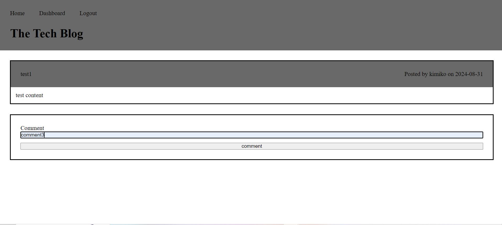

# Tech Blog

## Description

This application allows the user to create, view and comment on posts about tech

## Installation

To install necessary dependencies, run the following command:

...

'npm i'
...

## Usage

To use this application, click "login" in the navigation. You will then be taken to the login page where you can log into your account or you can click the link to "sign up instead" and create an account. Once you have created or logged into your account, you can then navigate to the dashboard where you can create a post. Once you create a post, it will apear on your dashboard. When you go to the homepage you will see yours and others posts. When you click on a post, you will be able to comment on it.You can also log out when you are finished. When logged out you will be directed to the login page when you click the dashboard link, and you won't be able to comment on, create, or edit posts.

[Deployed Application]()
## Credits

TA: getting comment information to display

## License

LICENSE in repo.